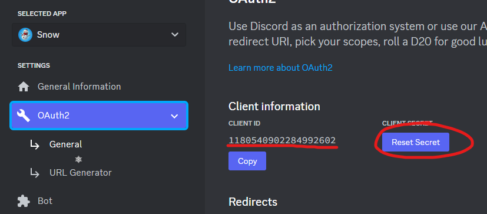
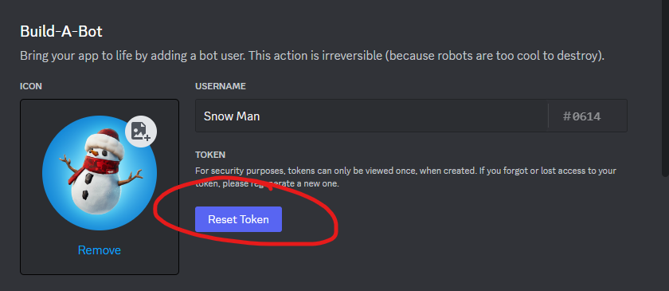
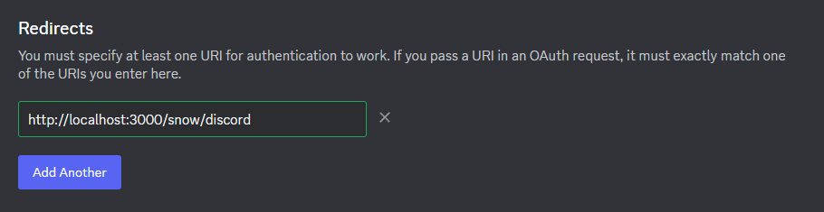
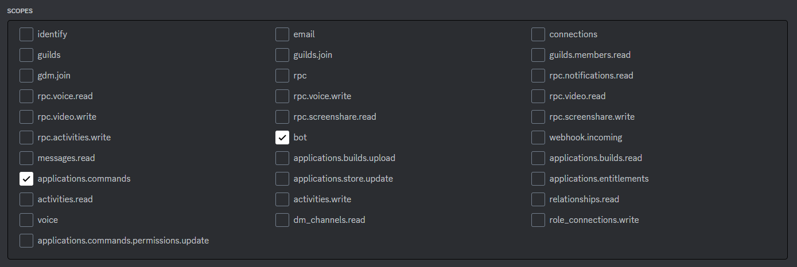
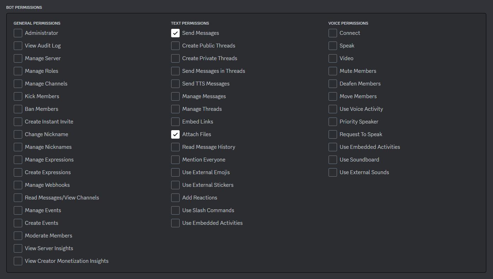

# Configure Discord OAuth

## Getting your OAuth Credentials





Part of the file `config.ini` should look like this:

```ini
[discord]
; discord id of the bot
id="1234567890..."
; oauth2 client secret
secret="abcdefg..."
; discord bot token
token="OTK...."
```

Replace the values with your own, save and rebuild to apply the changes.

## Setup the bot

Add the correct redirects to your discord application:



This will be from the `config.ini` file:

```ini
[api]
port=":3000"
host="http://localhost"
```

Make sure to add `/snow/discord` to the end of the redirect url.

## Inviting the bot

Generate an invite link for the bot with the following permissions:




The invite link should look like this:

```url
https://discord.com/api/oauth2/authorize?client_id=CLIENT_ID&permissions=34816&redirect_uri=CALLBACK_URL&scope=bot+applications.commands
```
